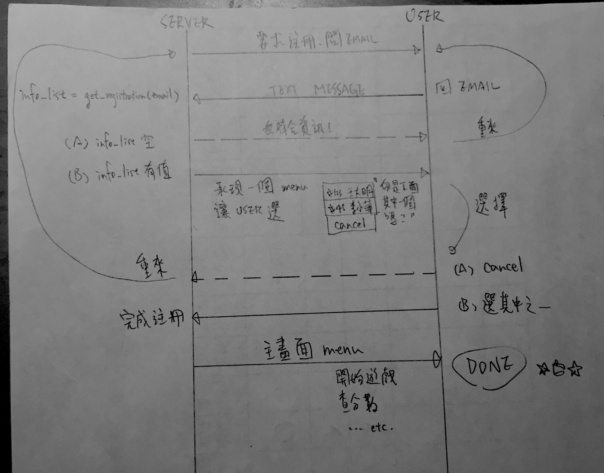

============================
PyCon Taiwan 2017 猜謎機器人
============================

規則
======

每個會眾用報名序號參加，回答大會出的題目獲得積分。

流程大概是

1. 會眾用某個 IM 系統開啟對話。

2. 如果使用者已經註冊，跳至 5.。如果使用者尚未註冊，要求輸入 email。

3. 根據 email 撈出可能的註冊資訊，
    * 無符合，回到 2.。
    * 有符合，則讓使用者選擇正確的註冊資訊（或取消）。

4. 根據使用者的選擇，
    * 取消，回到 2.。
    * 選擇其中一筆註冊資料，將該註冊資訊綁定目前的 IM 帳號與報名序號綁定。之後用這個帳號回答的題目都算在該報名序號上。

5. 推送使用者的下一個題目。選擇下一題的方法：
    a. 答對次數最少的題目。
    b. 若相同，答題次數最少的題目。
    c. 若相同，隨機。

6. 使用者選擇一個選項回答。系統收到後進行下面動作：
    a. 把這個回答資料存到資料庫。
    b. 推送需要的資訊（例如「恭喜所有題目答對！請領取獎品。」）。
    c. 回到 5.。

每個題目都可以回答無限多次。每次回答如果錯誤，可以獲得 1 分，答對可以獲得 1 + 錯誤選項數。

   註冊流程圖

資料
======

* 題庫：`sources.zip`。
* 註冊資料：`tickets.zip`。

技術細節
========

分兩部分：IM 端和資料端。

IM 端計畫支援 Facebook Messenger 與 LINE，放在 ``webapi`` 目錄。

後端就是一堆 Python functions 接 PostgreSQL，放在 ``quizzler`` 目錄（package）。

獎勵
======

全部題目答對的人可以獲得限量贈品。預計可以是：

* 貼紙簿（20 本左右）
* 去年的 T-shirt
* 今年的工作人員 T-shirt

任選一，每項送完為止。

分數最高的幾位可以獲得大獎。Keynote 簽名書之類的，要麻煩議程組去橋一下。
